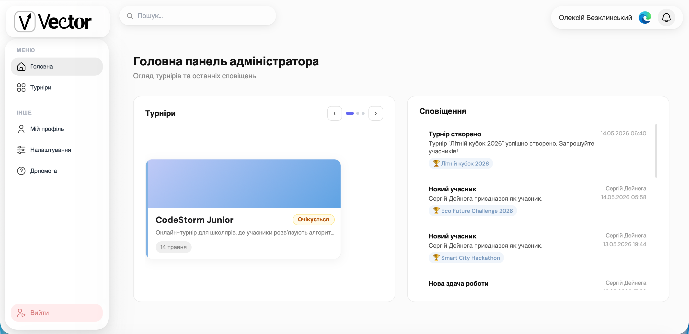
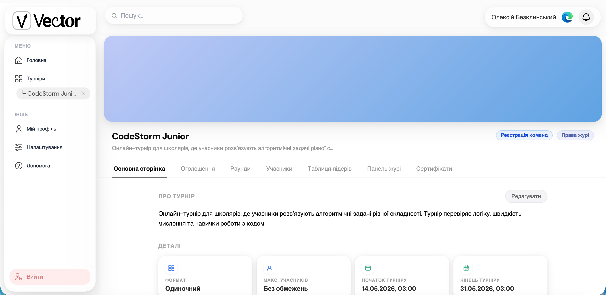
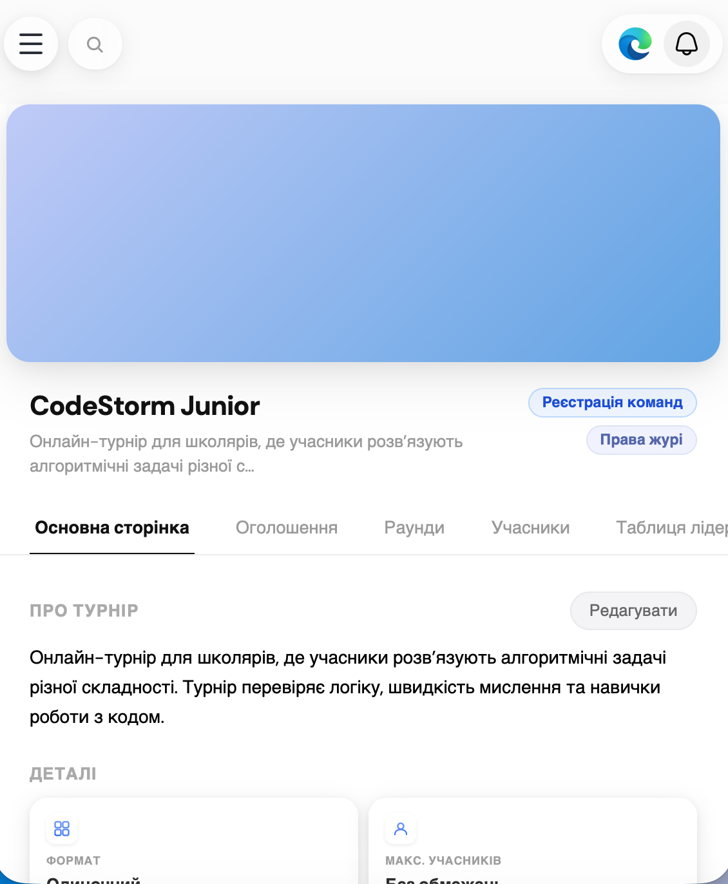

# Vector — Academic Tournament Platform

<div align="center">

<br/>

**Vector** is a full-stack web platform for organizing and running academic tournaments across any subject — in individual or team format.

<br/>

[](https://djangoproject.com)
[](https://www.django-rest-framework.org)
[](https://react.dev)
[](https://vitejs.dev)
[](https://sqlite.org)
[](https://jwt.io)

<br/>

</div>

---

## About

Vector goes beyond typical programming contest platforms. Any subject, any discipline — organizers can configure tournaments with custom rounds, tasks, jury members, and certificates, in both **individual and team formats**.

Built from scratch over **3 months** as a team project for a SFLU Tournament: custom REST API, React SPA with role-based access, real-time search, and a fully responsive UI.

---

## Screenshots

| Dashboard | Tournament Page | Mobile |
|:-:|:-:|:-:|
|  |  |  |

---

## Features

### For Organizers (Admin)
- Create tournaments with name, description, dates, cover image, and accent color
- Manage rounds and tasks within each tournament
- View and manage participants and teams
- Assign jury members for evaluation
- Issue certificates to participants upon completion

### For Participants
- Register and join tournaments
- Create teams and invite others — or compete individually
- Submit solutions to tasks
- View real-time leaderboard
- Receive notifications: new tasks, results, invitations

### Platform
- Role-based access: **admin / participant / jury**
- Real-time tournament search with debounce and results overlay
- Notification system with unread badge
- Fully responsive UI — mobile sidebar drawer, animated search bar
- UI preferences: warm color filter, logout button toggle
- JWT authentication with automatic token refresh

---

## Tech Stack

| Layer | Technology |
|-------|-----------|
| Frontend | React 18, Vite, CSS Modules |
| Backend | Django 6, Django REST Framework |
| Database | SQLite |
| Auth | JWT (SimpleJWT) + Token Blacklist |
| State | React Context API |
| Routing | React Router v6 |
| HTTP | Fetch API |

---

## Project Structure

```
vector/
├── apps/                        # Django apps
│   ├── users/                   # Auth, profiles
│   ├── tournaments/             # Tournament logic
│   ├── notifications/           # Notifications
├── config/                      # Django settings
├── frontend/                    # React SPA
│   └── src/
│       ├── features/            # Domain modules
│       │   ├── tournaments/     # Components, pages, helpers
│       │   ├── auth/
│       │   ├── profile/
│       │   ├── teams/
│       │   └── ...
│       ├── shared/              # Shared components, hooks, styles, contexts
│       ├── pages/               # Top-level pages
│       └── api.js               # API client
└── manage.py
```

---

## Getting Started

### Prerequisites
- Python 3.10+
- Node.js 18+
- npm

### 1. Clone the repository

```bash
git clone https://github.com/your-username/vector.git
cd vector
```

### 2. Backend

```bash
# Create and activate virtual environment
python -m venv venv
venv\Scripts\activate        # Windows
# source venv/bin/activate   # macOS / Linux

# Install dependencies
pip install -r requirements.txt

# Set up environment variables
cp .env.example .env
# Edit .env — set your SECRET_KEY

# Run migrations
python manage.py makemigrations
python manage.py migrate

# Create a superuser
python manage.py createsuperuser

# Start the server
python manage.py runserver
```

Backend runs at `http://127.0.0.1:8000`

### 3. Frontend

```bash
cd frontend

npm install
npm run dev
```

Frontend runs at `http://localhost:5173`

---

## Environment Variables

Create a `.env` file in the project root based on `.env.example`:

```env
SECRET_KEY=your-very-secret-key-here
DEBUG=True
ALLOWED_HOSTS=localhost,127.0.0.1
```

> ⚠️ Never commit `.env` to the repository — it is already listed in `.gitignore`.

---

## User Roles

| Role | Access |
|------|--------|
| `admin` | Create tournaments, manage rounds, tasks, participants, jury, certificates |
| `participant` | Join tournaments, manage teams, submit tasks, view results |
| `jury` | View and evaluate participant submissions |

---

## API Reference

```
POST   /api/users/register/            Register a new user
POST   /api/users/token/               Obtain JWT token pair
POST   /api/users/token/refresh/       Refresh access token

GET    /api/tournaments/               List tournaments (supports ?search=)
POST   /api/tournaments/               Create a tournament
GET    /api/tournaments/{id}/          Tournament details

GET    /api/notifications/             List notifications
POST   /api/notifications/mark-read/  Mark notifications as read
```

---

## Authors

Built by **Oleksii Bezklynskyi**, **Serhii Deineha** and **Artem Tsvelyh** as a team project over 3 months.
